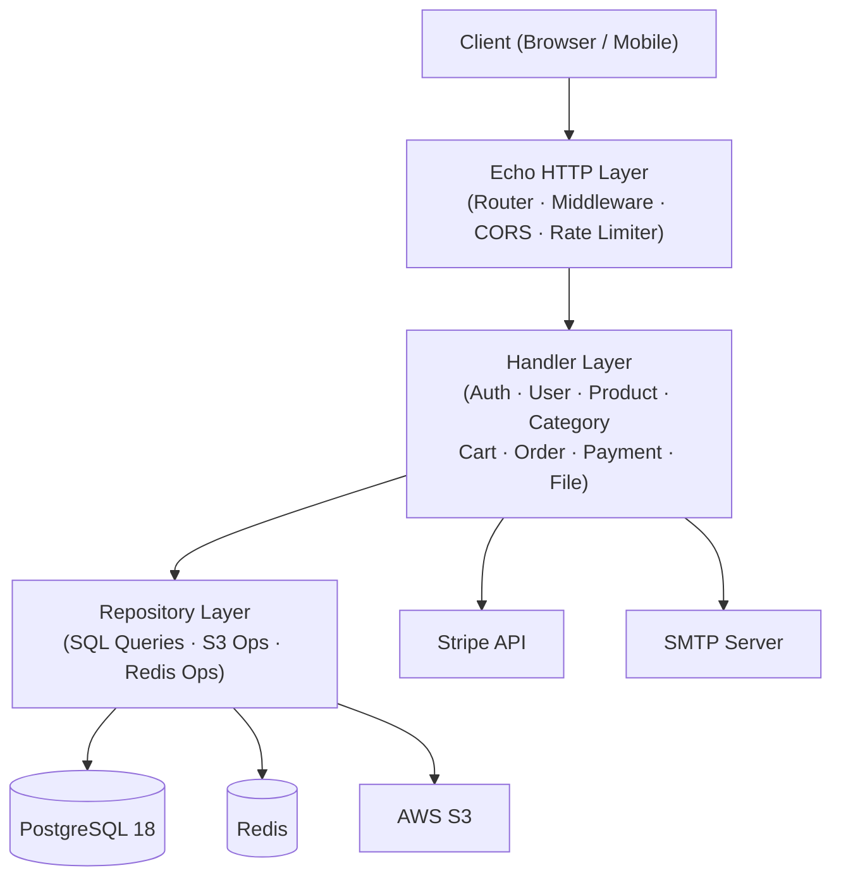

# Lorem E-Commerce Backend

  

A RESTful API server powering the Lorem e-commerce platform, built with Go, Echo, and PostgreSQL. Full OpenAPI documentation, CI/CD, and containerized deployment out of the box.

---

## Tech Stack

| Layer | Technology |
|---|---|
| Language / Runtime | Go 1.25 |
| HTTP Framework | Echo v4 |
| API Documentation | Huma v2 (OpenAPI 3.1) |
| Database / ORM | PostgreSQL 18 + GORM |
| Cache | Redis |
| Payments | Stripe |
| Object Storage | AWS S3 (or S3-compatible) |
| Email | SMTP |
| Auth | JWT (stateless) |
| DevOps | Docker, Docker Compose, GitHub Actions, Make |

---

## Architecture Overview

### Three-Layer Request Flow



---

## Prerequisites

1. **Go 1.25+** — https://go.dev/dl/
2. **Docker & Docker Compose** — https://docs.docker.com/get-docker/
3. **Make** — pre-installed on macOS/Linux; Windows users can use [GNU Make for Windows](https://gnuwin32.sourceforge.net/packages/make.htm) or WSL
4. **AWS S3-compatible service** — real AWS S3 bucket, or [LocalStack](https://docs.localstack.cloud/getting-started/) for local development
5. **Stripe account + Stripe CLI** — https://dashboard.stripe.com/register; CLI needed to forward webhooks locally
6. **SMTP credentials** — any SMTP provider; a [Gmail App Password](https://support.google.com/accounts/answer/185833) works out of the box

---

## Local Development Setup

1. **Clone the repository**

   ```sh
   git clone https://github.com/phuriphon47/lorem-e-commerce-backend.git
   cd lorem-e-commerce-backend
   ```

2. **Create your environment file**

   ```sh
   cp .env.example .env
   ```

   Open `.env` and fill in all required variables. See the [Configuration Reference](#configuration-reference) section below for a full description of every variable.

3. **Start the development stack**

   ```sh
   make dev-up
   ```

   This command brings up three containers:
   - **Backend** on `:5000` with [Air](https://github.com/air-verse/air) hot-reload (code changes restart the server automatically)
   - **PostgreSQL 18** on `:5433`
   - **Redis** on `:6379`

4. **Verify the server is healthy**

   ```sh
   curl http://localhost:5000/health
   ```

   Expected response:

   ```json
   {"status":"ok"}
   ```

5. **Explore the interactive API docs**

   Open http://localhost:5000/docs in your browser. The Stoplight Elements UI lets you browse all endpoints, inspect request/response schemas, and send live requests.

---

## Configuration Reference

All configuration is supplied through environment variables. Copy `.env.example` to `.env` and populate each group below.

### Server

| Variable | Description |
|---|---|
| `PORT` | Port the HTTP server listens on (e.g. `5000`) |

### Database

| Variable | Description |
|---|---|
| `DB_HOST` | PostgreSQL host (e.g. `localhost` or Docker service name) |
| `DB_USER` | PostgreSQL username |
| `DB_PASSWORD` | PostgreSQL password |
| `DB_NAME` | Database name |
| `DB_PORT` | PostgreSQL port (default `5432`; dev Compose exposes `5433`) |
| `DB_MAX_OPEN_CONNS` | Maximum open connections in the pool (default `50`) |
| `DB_MAX_IDLE_CONNS` | Maximum idle connections in the pool (default `25`) |
| `DB_CONN_MAX_LIFETIME_MIN` | Max connection lifetime in minutes (default `30`) |
| `DB_CONN_MAX_IDLE_TIME_MIN` | Max connection idle time in minutes (default `5`) |

### Redis

| Variable | Description |
|---|---|
| `REDIS_HOST` | Redis host (e.g. `localhost` or Docker service name) |
| `REDIS_PORT` | Redis port (default `6379`) |
| `REDIS_PASSWORD` | Redis password (leave empty if auth is disabled) |

### Auth / JWT

| Variable | Description |
|---|---|
| `JWT_SECRET` | HS256 signing secret — use a long, random string in production |
| `JWT_EXPIRE` | Token lifetime in Go duration format (e.g. `24h`, `168h`) |

> **Note:** Password-reset tokens are stateless JWTs valid for **10 minutes**, generated at request time — no database persistence required.

### CORS

| Variable | Description |
|---|---|
| `FRONTEND_URL` | Allowed origin for CORS (e.g. `http://localhost:3000`) |

### AWS S3

| Variable | Description |
|---|---|
| `S3_URL` | S3 endpoint URL — use `https://s3.amazonaws.com` for real AWS, or your LocalStack URL (e.g. `http://localhost:4566`) |
| `BUCKET_NAME` | Target S3 bucket name |
| `AWS_ACCESS_KEY` | AWS (or LocalStack) access key ID |
| `AWS_SECRET_KEY` | AWS (or LocalStack) secret access key |
| `AWS_REGION` | AWS region (e.g. `ap-southeast-1`) |

### Stripe

| Variable | Description |
|---|---|
| `STRIPE_SECRET_KEY` | Stripe secret API key (`sk_test_...` for test mode) |
| `STRIPE_WEBHOOK_SECRET` | Webhook signing secret (`whsec_...`) — obtained from Stripe dashboard or Stripe CLI |
| `STRIPE_SESSION_EXPIRE` | Checkout session expiry in seconds (e.g. `1800` for 30 minutes) |

### SMTP

| Variable | Description |
|---|---|
| `SMTP_HOST` | SMTP server hostname (e.g. `smtp.gmail.com`) |
| `SMTP_PORT` | SMTP port (e.g. `587` for TLS/STARTTLS) |
| `SMTP_USER` | SMTP username / email address |
| `SMTP_PASSWORD` | SMTP password or App Password |
| `SMTP_FROM` | Sender address shown in the `From` header |

### Rate Limiting

| Variable | Description |
|---|---|
| `RATE_LIMIT_LIMIT` | Maximum requests allowed per window (default `5`) |
| `RATE_LIMIT_PERIOD_SEC` | Window duration in seconds (default `60`) |

> **Note:** Rate limiting is applied to sensitive auth endpoints: `POST /auth/signin`, `POST /auth/register`, and `POST /auth/forgot-password`.

---

## Available Make Targets

| Target | Description |
|---|---|
| `dev-up` | Start development stack (backend + PostgreSQL + Redis) with hot-reload |
| `dev-down` | Stop and remove development containers |
| `dev-restart` | Restart the development stack |
| `dev-logs` | Tail logs from development containers |
| `dev-clean` | Stop dev containers and remove associated volumes |
| `prod-up` | Start production stack using the optimised multi-stage image |
| `prod-down` | Stop and remove production containers |
| `prod-restart` | Restart the production stack |
| `prod-logs` | Tail logs from production containers |
| `prod-clean` | Stop prod containers and remove associated volumes |
| `db-up` | Start only the PostgreSQL container |
| `db-down` | Stop the PostgreSQL container |
| `db-restart` | Restart the PostgreSQL container |
| `db-clean` | Stop the database container and remove its volume |
| `seed-db` | Seed the database with initial reference data |
| `lint` | Run `gofmt` and `go vet` across the codebase |
| `test` | Run the full unit-test suite |
| `coverage-check` | Run tests and enforce a strict **80% coverage** threshold |
| `pre-commit` | Run `lint` then `test` — recommended as a Git pre-commit hook |

---

## API Documentation

The server auto-generates an OpenAPI 3.1 specification via **Huma v2** and serves it through a **Stoplight Elements** interactive UI.

| Resource | URL |
|---|---|
| Interactive docs (Stoplight Elements) | http://localhost:5000/docs |
| Raw OpenAPI JSON schema | http://localhost:5000/openapi.json |

The API is versioned under the `/api/v1` base path and exposes modules for **Auth**, **User**, **Product**, **Category**, **Cart**, **Order**, **Payment**, and **File** uploads.

---

## Deployment

For a quick local production simulation, run `make prod-up`. This builds the optimised multi-stage Docker image (Alpine-based, non-root user, health-check configured) and starts the stack exactly as it would run in a production environment.